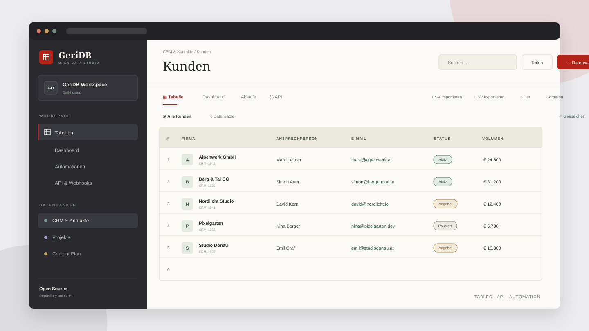

# GeriDB



[Live-Demo öffnen](https://geridb.gerald-hierzberger.chatgpt.site/) · [n8n- und Voicebot-Anleitung](docs/N8N-VOICEBOT.md)

GeriDB ist eine deutschsprachige Open-Source-Tabellendatenbank für Teams und KI-Agenten. Sie verbindet eine spreadsheet-ähnliche Oberfläche mit Dashboards, CSV-Austausch, Automationskonfiguration und einer REST-API – als schlanke, selbst hostbare Alternative für typische NocoDB-Anwendungsfälle.

> Status: funktionsfähiges Open-Source-MVP. Die Kernabläufe sind implementiert und getestet; GeriDB bildet noch nicht den vollständigen Funktionsumfang einer langjährig entwickelten Plattform wie NocoDB ab.

## Funktionen

- mehrere anklickbare Tabellen mit getrennten persistenten Datensätzen
- eigene Tabellen direkt in der Oberfläche anlegen und wieder löschen
- Datensätze anlegen, bearbeiten, löschen, durchsuchen, filtern und sortieren
- Felder anlegen, umbenennen, formatieren, duplizieren, positionieren, ausblenden und löschen
- Feldtypen für Text, Zahl, Währung, Auswahl, Datum, Jahr, Uhrzeit, Checkbox, Telefon, E-Mail, URL und Bewertung
- CSV-Import und -Export im Excel-kompatiblen Semikolon-Format
- dynamisches Dashboard auf Basis der jeweils aktiven Tabelle
- Automationen je Tabelle anlegen, aktivieren, deaktivieren und löschen
- REST-API für Tabellen, Felder, Datensätze und Automationen
- optionale Bearer-Token-Absicherung und CORS für Agenten und externe Tools
- WebMCP-Werkzeuge zum Lesen und Anlegen von Datensätzen
- vorbereitet für n8n und Voicebot-Agenten
- eigener n8n Community Node für Tabellen- und Datensatzoperationen

## Schnellstart

Voraussetzungen: Node.js 22.13 oder neuer und pnpm.

```bash
git clone https://github.com/Geraldki94/geridb.git
cd geridb
pnpm install
pnpm db:migrate:local
pnpm dev
```

GeriDB läuft danach unter [http://localhost:3016](http://localhost:3016).

## Nutzung mit n8n oder einem Voicebot

Jede Tabelle besitzt eine feste ID. Für das CRM lautet sie `tbl_customers`.

Kontakt über Telefonnummer oder E-Mail suchen:

```bash
curl "http://localhost:3016/api/v1/records?table=tbl_customers&search=%2B436601234567"
```

Gesprächsergebnis speichern:

```bash
curl -X POST "http://localhost:3016/api/v1/records?table=tbl_customers" \
  -H "Content-Type: application/json" \
  -H "Authorization: Bearer DEIN_API_KEY" \
  -d '{"company":"Max Mustermann","phone":"+43 660 1234567","status":"Kontakt","notes":"Rückruf am Nachmittag gewünscht"}'
```

Eine vollständige Schritt-für-Schritt-Anleitung steht in [docs/N8N-VOICEBOT.md](docs/N8N-VOICEBOT.md).

### Eigener n8n Community Node

Der Quellcode für `n8n-nodes-geridb` liegt unter [packages/n8n-nodes-geridb](packages/n8n-nodes-geridb). Der Node unterstützt Suchen, Anlegen, Aktualisieren und Löschen von Datensätzen sowie das Auflisten aller Tabellen. Er kann auch als Werkzeug eines n8n-AI-Agenten eingesetzt werden.

```bash
pnpm --filter n8n-nodes-geridb build
```

Nach der separaten Veröffentlichung bei npm lässt sich das Paket in einer selbst gehosteten n8n-Instanz über **Settings → Community Nodes** installieren.

## REST API

Alle tabellenbezogenen Routen akzeptieren `?table=<TABELLEN_ID>`. Ohne Parameter wird `tbl_customers` verwendet.

| Methode  | Pfad                                        | Zweck                              |
| -------- | ------------------------------------------- | ---------------------------------- |
| `GET`    | `/api/v1/tables`                            | Tabellen auflisten                 |
| `POST`   | `/api/v1/tables`                            | Tabelle anlegen                    |
| `DELETE` | `/api/v1/tables?id=:id`                     | benutzerdefinierte Tabelle löschen |
| `GET`    | `/api/v1/fields?table=:table`               | Felder auflisten                   |
| `POST`   | `/api/v1/fields?table=:table`               | Feld anlegen                       |
| `PATCH`  | `/api/v1/fields?table=:table`               | Feld ändern                        |
| `DELETE` | `/api/v1/fields?table=:table&id=:id`        | Feld löschen                       |
| `GET`    | `/api/v1/records?table=:table&search=:text` | Datensätze lesen oder suchen       |
| `POST`   | `/api/v1/records?table=:table`              | Datensatz anlegen                  |
| `PATCH`  | `/api/v1/records?table=:table`              | Datensatz anhand von `id` ändern   |
| `DELETE` | `/api/v1/records?table=:table&id=:id`       | Datensatz löschen                  |
| `GET`    | `/api/v1/automations?table=:table`          | Automationen lesen                 |
| `POST`   | `/api/v1/automations?table=:table`          | Automation anlegen                 |
| `PATCH`  | `/api/v1/automations?table=:table`          | Automation aktivieren/deaktivieren |
| `DELETE` | `/api/v1/automations?table=:table&id=:id`   | Automation löschen                 |

## API absichern

Ohne Konfiguration ist die API für einen einfachen lokalen Start offen. Für öffentlich erreichbare Daten sollte `GERIDB_API_KEY` als Secret gesetzt werden. Externe Clients senden anschließend:

```http
Authorization: Bearer DEIN_API_KEY
```

Mit `GERIDB_ALLOWED_ORIGIN` lässt sich zusätzlich eine Browser-Origin festlegen. Ein Beispiel steht in [.env.example](.env.example). Gleichursprüngliche Aufrufe aus der GeriDB-Oberfläche bleiben bei gesetztem API-Key funktionsfähig.

## Produktions-Build

```bash
pnpm build
```

Das Projekt ist für Cloudflare Workers und D1 vorbereitet. Die versionierte Datenbankmigration liegt in `drizzle/`; die logische D1-Bindung heißt `DB`.

## Architektur

- React 19 und TypeScript
- Vinext/Vite mit Next-kompatiblem Routing
- Tailwind CSS und Shadcn-Komponenten
- Cloudflare Workers und D1
- Drizzle ORM für das Datenbankschema
- MIT-Lizenz

## Noch nicht enthalten

- Benutzerkonten, Rollen und Team-Berechtigungen
- relationale Verknüpfungen, Formeln und Rollups
- Datei-Anhänge und Objekt-Speicher
- eigenständiger Job-Runner, der konfigurierte Automationen zeitgesteuert ausführt
- PostgreSQL- und Docker-Variante

Beiträge, Issues und Pull Requests sind willkommen.

## Lizenz

MIT – siehe [LICENSE](LICENSE).
